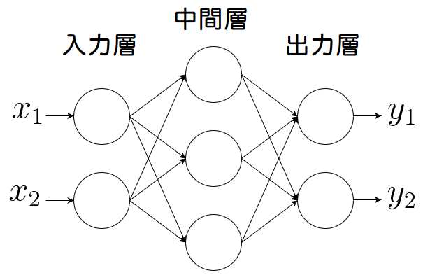

# ニューラルネットワークについて

<br>

## パーセプトロン


## 重みとバイアス


## ニューラルネットワーク


## XORを作る


cmd起動　python と入力

```
C:\Users>python
Python 3.7.3 ~~~~~~~~~~~~~~~
~~~~~~~~~~~~~~~~~~~~~~~~~~~~
>>>
```
AND回路を作ろう  
```python
def AND(a, b):
  if a == 1 and b == 1:
    return 1
  else:
    return 0
```
確認しよう  
```
>>>AND(0,0)
0
>>>AND(0,1)
0
>>>AND(1,0)
0
>>>AND(1,1)
1
```
OR回路を作ろう  
```python
def OR(a, b):
  if a == 0 and b == 0:
    return 0
  else:
    return 1
```
確認しよう  
```
>>>OR(0,0)
0
>>>OR(0,1)
1
>>>OR(1,0)
1
>>>OR(1,1)
1
```
NOT回路を作ろう  
```python
def NOT(a):
  if a == 0:
    return 1
  else:
    return 0:
```
確認しよう
```
>>>NOT(1)
0
>>>NOT(0)
1
>>>NOT(OR(1,1))
0
```
  
XORは非線形  
よってパーセプトロンを多層にする必要あり  
実際にやってみよう  
↓答え  
↓　  
↓　  
↓　  
↓　  
↓　  
↓　  
↓　  
↓　  
↓　  
↓　  
↓　  
↓　  
↓　  
↓　  
↓　  
↓　  
↓　  
↓　  
↓　  
↓　  
↓　  
↓　  
↓　  
↓　  
↓　  
↓　  
↓　  
XOR回路  
```python
def XOR(a, b):
  c = AND(a, b)
  c = NOT(c)
  d = OR(a, b)
  return AND(c, d)
```
確認しよう  
```
>>>XOR(0, 0)
0
>>>XOR(1, 0)
1
>>>XOR(0, 1)
1
>>>XOR(1, 1)
0
```

<br>

[前へ](1.md)・[次へ](3.md)

<br>

[HOME](index.md)
