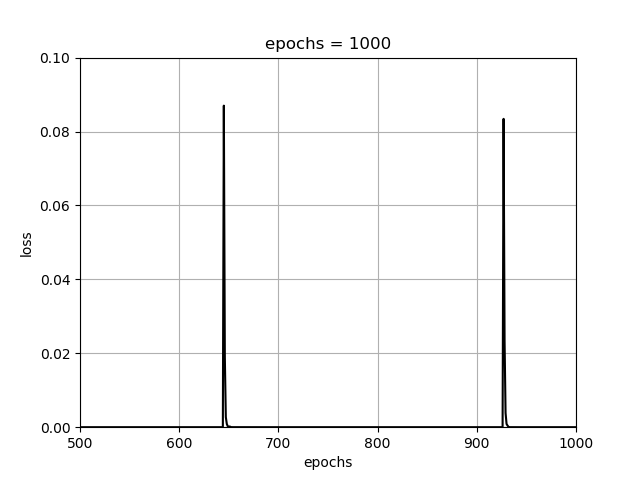

# 学習について

## 学習
学習とは、教師データから重みやバイアスを決めることです。  

## バッチサイズとエポック
バッチサイズとは、教師データからランダムに選んだ一部のデータをひとかたまりにしたものです。  
エポックとは試行回数です。  
この２つはAIの精度に関係しています。  

バッチサイズは、大きいと学習スピードが速くなります。しかし、学習の質がよくありません。  
逆に少ないと学習の質が良くなり、学習スピードは遅くなります。　　

  
縦軸のlossは精度みたいなもの。0に近いほどよい　　

  
1000に比べて同じエポックのlossは0に近い  

  
100とあまりあまり変わらない　　

エポックは単純に学習を何回するかということです。  

  

  
10とくらべてlossが0に近い  

## 過学習(番外編)
AIには汎化能力が必要  
教師データに過剰に適合してテストデータへの精度が低くなった状態を過学習といいます。  
  
lossが急に上がっている  
  
こうなると過学習だと思われる  

この結果から、エポックは下げて

 
[前へ](2.md)・[次へ](4.md)

[HOME](index.md)
