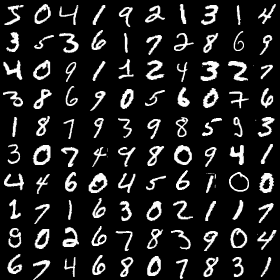
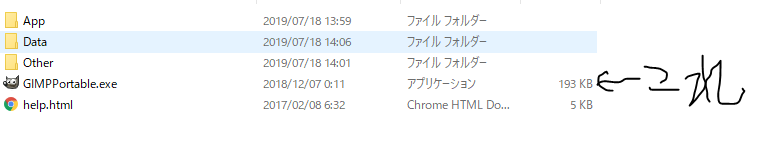
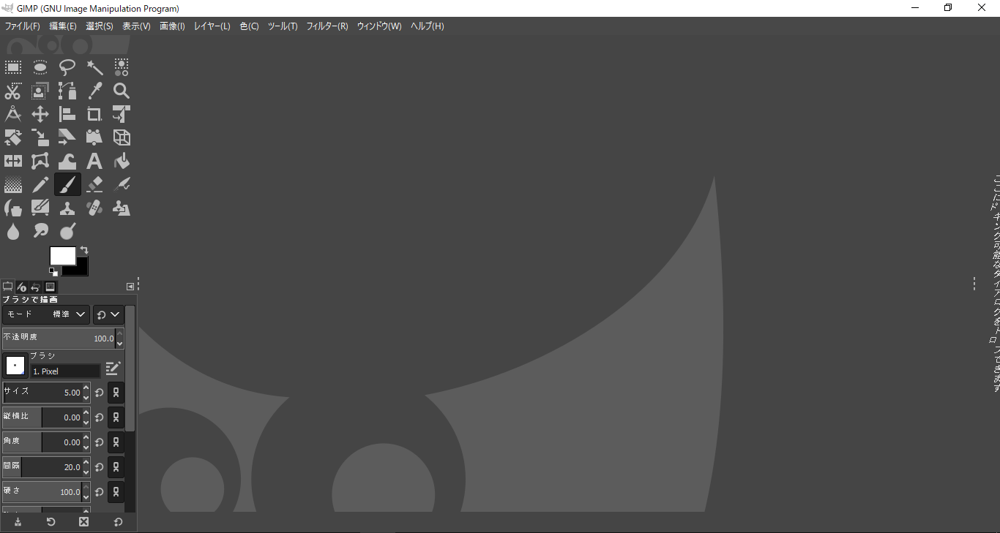
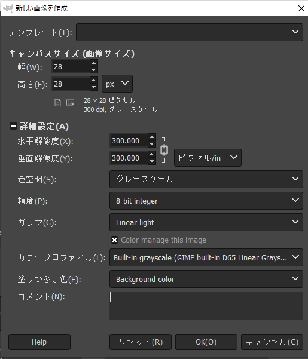
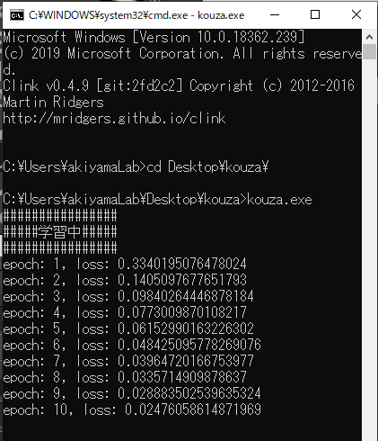
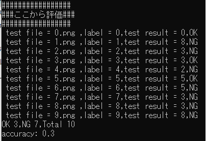
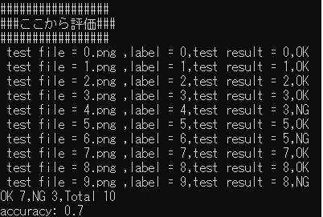

# 実際にやってみよう

## 学習
今回は数字の識別をしたいと思います。  
学習のためのデータセットは、mnistです。  
mnistとは60000枚のpngファイルで内容は0から9までの数字です。  
  
mnistを使った学習では、mnistのデータを判定すると90％以上の正答率になりますが、  
未知のデータに対して正答率が下がることがあります。
なので、今回は自分で書いた画像を  
mnistにプラスして学習をさせましょう。  

デスクトップのkouzaフォルダを開いてください。  

  

その中のGIMPPortableを開き、exeを起動してください。  

  
↓　  
  

ファイルの新しい画像の生成をクリックしてください。  

  

画像のように選択したらOKをクリックしましょう。  

  

筆を選択してください。  

書いてみましょう。  

  

書いたらCtrl + Shift + E を押してください。  

  

デスクトップのkouzaのtest_dataを選択し、ファイル名を描いた数字.pngにしてEnterしてエクスポート  

完了したら、コマンドプロンプトでAI_kouzaフォルダのkouza.exeを動かしてください。  

  

## 判定
結果が出たと思います。  

  

accuracy=0.3 正答率30％ 低い  
改善するため、今度は画像のエクスポートをtrain_dataでおこないます。  

  

accuracy=0.7 正答率70% 改善できた  

次に、同じフォルダのkouza.pyを見てみましょう。  
まず、このプログラムを動かすためのライブラリを入れたいと思います。  
使うライブラリは、numpy, opencv-python, chainerです。  
```
pip install opencv-python
pip install chainer
```
numpyは入れてあります。  

では、メモ帳でkouza.pyを開いてください。  
80行から84行を見てください。  
```
# Number of epochs
n_epoch = 25

#batch_size
batch_size = 100
```
エポックが25、バッチサイズが100になっています。  
ここを変えて保存しましょう。  
```
python kouza.py
```
で実行できます。  


<br>
[前へ](3.md)・[次へ](5.md)

[HOME](index.md)
