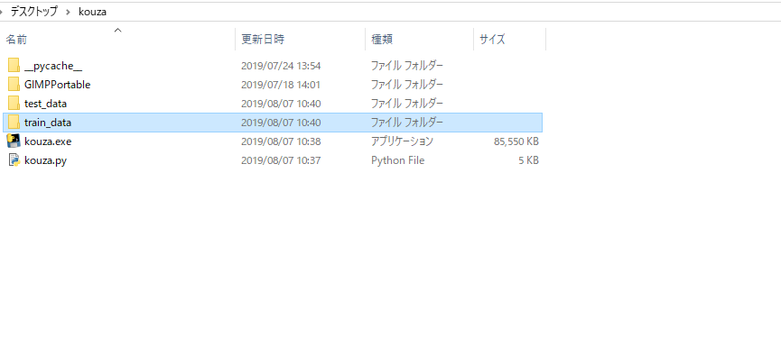
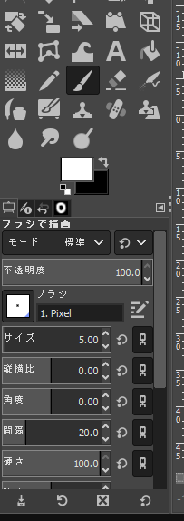
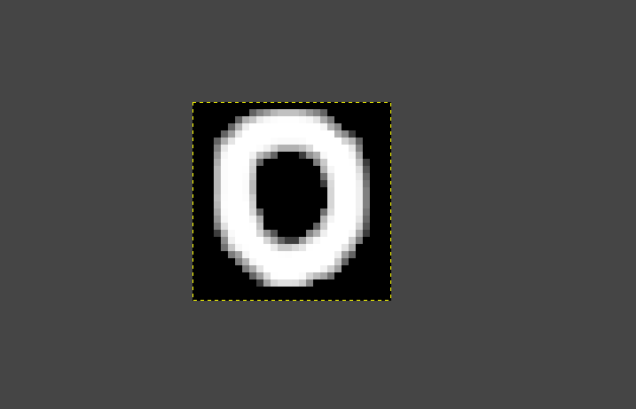
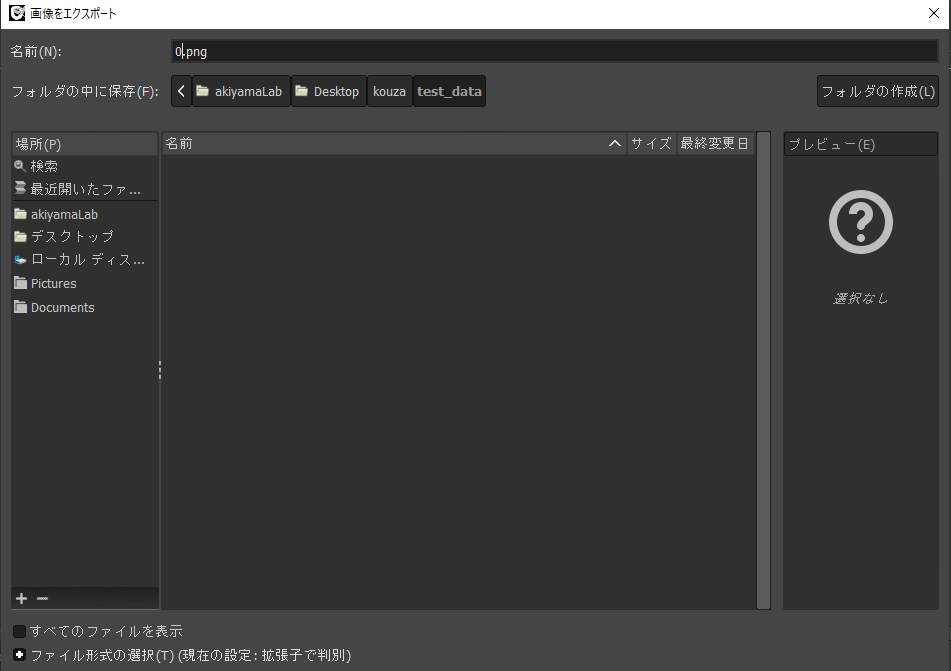
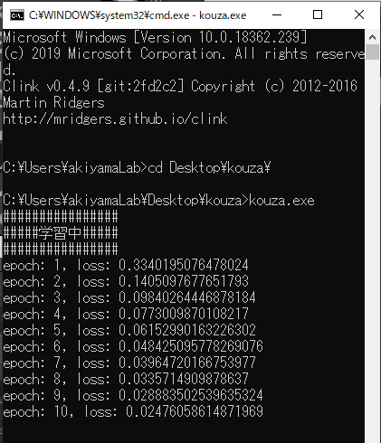
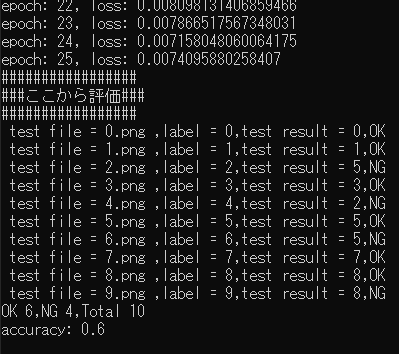

# 実際にやってみよう

## 学習
今回は数字の識別をしたいと思います。  
学習のためのデータセットは、mnistです。  
mnistとは60000枚のpngファイルで内容は0から9までの数字です。  
mnistを使った学習では、mnistのデータを判定すると90％以上の正答率になりますが、  
未知のデータに対して正答率が下がることがあります。
なので、今回は自分で書いた画像を  
mnistにプラスして学習をさせましょう。  
デスクトップのkouzaフォルダを開いてください。  

  

その中のGIMPPortableを開き、exeを起動してください。  

  

  

ファイルの新しい画像の生成をクリックしてください。  

  

画像のように選択したらOKをクリックしましょう。  

  

筆を選択してください。  

書いてみましょう。  

  

書いたらCtrl + Shift + E を押してください。  

  

デスクトップのkouzaのtrain_dataを選択し、名前を描いた数字にしてEnterしてエクスポート  

↑ここまでの作業を0から9まで進めたら、今度はエクスポートをkouzaのtest_dataでおこないましょう。  

完了したら、cmdでAI_kouzaフォルダのkouza.exeを動かしてください。  

  

## 判定
結果が出たと思います。  

  

 
[前へ](3.md)・[次へ](5.md)

[HOME](index.md)
