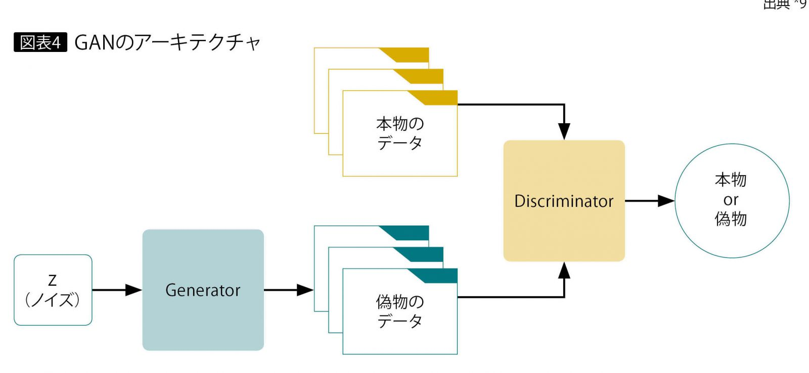
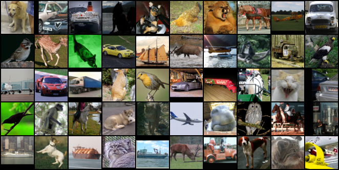

# 終わりに

## 他のAIの紹介
今回のものとは別のAIを紹介します。  
GAN(Generative Adversarial Network)は敵対的生成ネットワークといい、  
データの生成と識別をしながら学習します。  

  

画像のデータから以下のようにデータを生成します。  

  
↓　  
  

見てると面白いので興味を持っていただけたら幸いです。  

## 事後アンケート
本日は講座にご参加いただきありがとうございました。  
最後に事後アンケートにご協力おねがいします。  
[アンケートはこちら](https://forms.gle/U593nFjjSk4zqwH4A){:target="_blank"}

 
[前へ](4.md)

[HOME](index.md)
